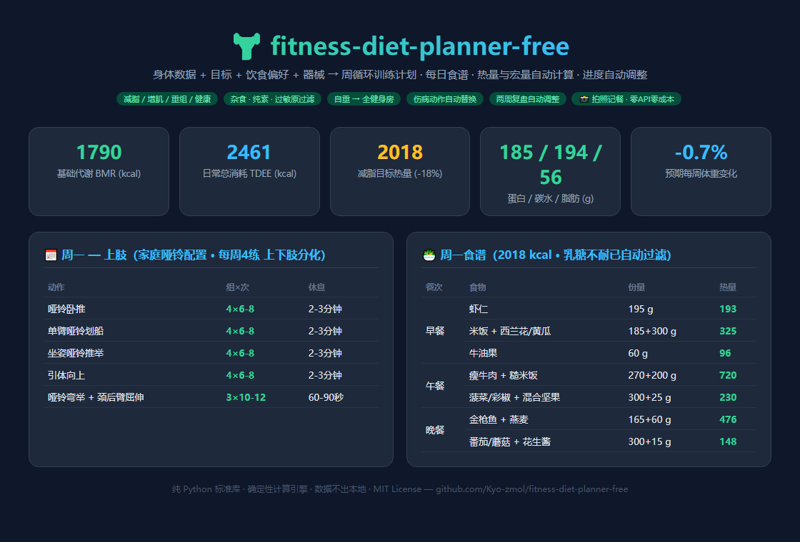
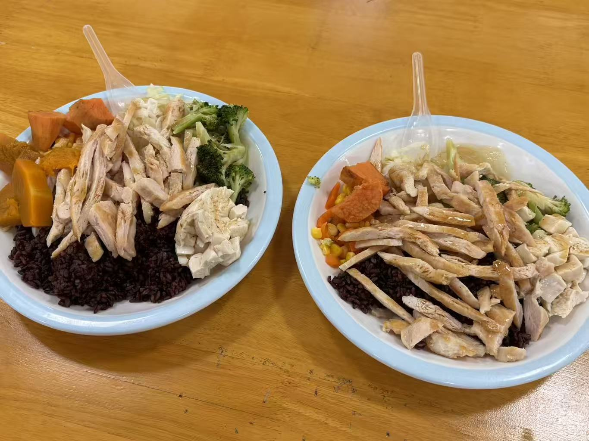
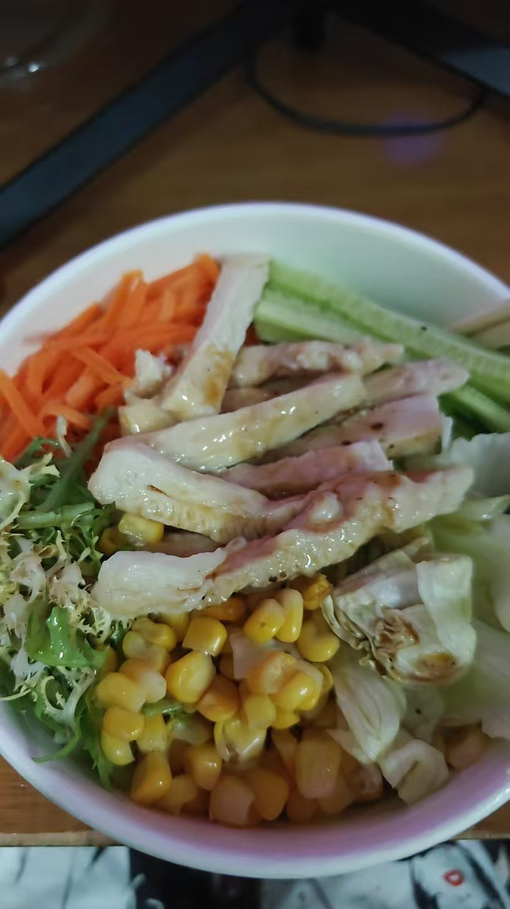

# 🏋️ fitness-diet-planner-free

**A Codex skill that turns your body data, goals, diet preferences, and available equipment into a complete weekly training plan + daily meal plan — with calories and macros computed by a deterministic engine, and progress-based adjustments built in.**

输入身体数据、训练目标、饮食偏好和可用器械，生成按周循环的训练计划和每日食谱；热量与宏量营养素全部由脚本精确计算；支持每两周复盘并自动调整目标。

[](https://www.python.org/)
[](LICENSE)
[](https://github.com/openai/codex)
[]()
[](https://github.com/Kyo-zmol/fitness-diet-planner/actions/workflows/ci.yml)

---



## ✨ Features

| | |
|---|---|
| 🎯 **Goal-aware energy targets** | Fat loss / bulk / recomp / health, three intensities each; BMR via Mifflin-St Jeor or Katch-McArdle (if body fat is known), TDEE via activity multipliers, hard calorie floors |
| 🥗 **Automatic meal plans** | 7-day rotating menus from a 40+ food database; protein portioned by grams, fat by budget, carbs fill the remainder; iterative reconciliation keeps weekly averages on target |
| 🚫 **Diet filters** | omnivore / no-pork / pescatarian / vegetarian / vegan, plus allergen exclusion (lactose, gluten, nuts, seafood, eggs, soy) and personal dislikes |
| 🏠 **Equipment-aware training** | Bodyweight-only to full gym; splits auto-selected from 2–6 days/week (full body, upper/lower, PPL); no exercise repeated within a week |
| 🩹 **Injury-safe swaps** | Knee / shoulder / lower-back / wrist: contraindicated exercises are replaced from candidate lists (or dropped), with safety notes |
| 🔁 **Progress check-ins** | Report weekly-average weight + adherence every 2 weeks; the engine adjusts calories (never below the floor), prescribes diet breaks, and flags strength stalls |
| 📸 **Photo meal logging** | Share a food photo — the agent’s own vision identifies dishes and portions, a built-in 75+ ingredient / Chinese-dish database computes calories deterministically, and intake is checked against your daily targets. **No API keys, no external services, zero cost** |
| 🛡️ **Safety rails** | Rejects deficits for pregnancy/lactation, BMI < 17.5, aggressive cuts with ED history; warns for BMI ≥ 30, age < 18 / > 65, diabetes, kidney disease |
| 🧮 **Deterministic & auditable** | Pure Python standard library — no APIs, no dependencies, no data leaves your machine |

## 🔧 How it works

```text
Interview ──► profile.json ──► plan_calculator.py generate ──► plan.md + plan.json + progress.csv
                                       │
                              every 2 weeks │  weight trend + adherence
                                       ▼
                        plan_calculator.py checkin --save ──► adjusted targets + action report
```

1. **Energy** — BMR × activity factor = TDEE; goal-specific deficit/surplus applied; floors: never below BMR, ≥1500 kcal (men) / ≥1200 kcal (women).
2. **Macros** — protein 1.6–2.4 g/kg by goal/experience (adjusted body weight when BMI ≥ 28), fat ≥ 25% of calories and ≥ 0.5 g/kg, carbs take the remainder; fiber 14 g/1000 kcal, water 35 ml/kg.
3. **Meals** — protein dishes sized to per-meal protein grams; low-density proteins (e.g. tofu) auto-blend with a lean partner; fatty cuts are portion-capped by the meal fat budget; background protein from staples is measured and subtracted in a second build pass.
4. **Training** — split chosen from training days + experience; exercises filtered by equipment and deduplicated weekly; set/rep schemes follow the goal (e.g. cutting keeps heavy 4×6-8 compounds to preserve muscle).
5. **Adjustments** — one variable at a time: slow loss → −150 kcal, too fast (>1.2%/wk) → +150 kcal, adherence < 70% → fix execution first, strength stall → deload week.

## 🚀 Installation

**Codex (recommended)** — ask Codex to install it, or run the built-in installer:

```bash
python ~/.codex/skills/.system/skill-installer/scripts/install-skill-from-github.py \
  --repo Kyo-zmol/fitness-diet-planner-free --path . --name fitness-diet-planner
```

**Manual** — clone into your skills directory:

```bash
# Codex
git clone https://github.com/Kyo-zmol/fitness-diet-planner-free.git ~/.codex/skills/fitness-diet-planner
# Claude Code
git clone https://github.com/Kyo-zmol/fitness-diet-planner-free.git ~/.claude/skills/fitness-diet-planner
```

On Windows use `%USERPROFILE%\.codex\skills\fitness-diet-planner`. No dependencies to install — Python 3.10+ standard library only. The skill is available on your next conversation turn.

## 💬 Usage

**Generate a plan** — just talk to the agent; it will interview you (2–3 rounds), then run the engine:

> 我 31 岁男，176cm / 84kg，办公室工作，想减脂。家里有一对哑铃、卧推凳和引体杆，每周能练 4 天，乳糖不耐，一天吃三顿。

or in English: *"I'm a 27-year-old vegan woman, 162 cm / 58 kg, want to recomp with bands only 3 days a week, I have a knee injury."*

Output lands in `fitness-plan/` in your workspace:

| File | Purpose |
|---|---|
| `profile.json` | Your inputs (editable — rerun to regenerate) |
| `plan.md` | The full readable plan: energy table, daily training tables, 7-day meals, warnings |
| `plan.json` | Machine-readable plan, consumed by check-ins |
| `progress.csv` | Your weigh-in log: `date,weight_kg,adherence_pct,training_completed,notes` |
| `food_log.csv` | Meal log from photos/text: `date,meal,name,grams,kcal,p,c,f,source` |

**Log a meal from a photo** — just send the picture:

> （发一张午餐照片）帮我记一下这顿，看看还剩多少热量额度

The agent identifies dishes, estimates grams (bowl/palm cues), logs to `fitness-plan/food_log.csv` via
`plan_calculator.py log`, and shows intake vs. remaining targets. Unknown dishes fall back to
vision-estimated macros, clearly labeled `vision-est`. End the day with `summary` for a verdict.

**Check in** (every 2 weeks, use the 7-day average of fasted morning weigh-ins):

> 两周过去了，这周平均体重 83.6，执行率大概 90%，力量没涨。

The agent runs `checkin --plan … --weight … --adherence … [--strength-stalled] --save` and hands you a verdict + adjusted targets + action items.

## 📸 Sample output

Real excerpt from a generated plan (male, 31, 176 cm / 84 kg, fat loss, home dumbbells, lactose-intolerant):

```markdown
## 一、身体数据与能量目标
| 指标 | 数值 |
| 基础代谢 BMR | 1790 kcal |
| 日常总消耗 TDEE | 2461 kcal |
| **每日目标热量** | **2018 kcal**（相对 TDEE -18.0%） |
| 蛋白质 | 185 g（2.2 g/kg × 84 kg） |

### 周一 — 上肢
| 动作 | 组×次 | 组间休息 |
| 哑铃卧推 | 4×6-8 | 2-3分钟 |
| 单臂哑铃划船 | 4×6-8 | 2-3分钟 |
| 引体向上 | 4×6-8 | 2-3分钟 |

### 周一食谱（乳糖不耐已自动过滤）
| 早餐 | 虾仁 195 g + 米饭 185 g + 西兰花/黄瓜 300 g + 牛油果 60 g | 592 kcal |
| 午餐 | 瘦牛肉 270 g + 糙米饭 200 g + 菠菜/彩椒 300 g + 坚果 25 g | 950 kcal |
| 晚餐 | 金枪鱼 165 g + 燕麦 60 g + 番茄/蘑菇 300 g + 花生酱 15 g | 625 kcal |
**食谱实际宏量（日均）**：热量 2030 kcal ｜ 蛋白 186 g ｜ 碳水 194 g ｜ 脂肪 65 g
```

## 📷 Real-world example (photo → calories)

Two shared photos, three servings — identified by vision, computed by the engine:

|  |  |
|:---:|:---:|
| Photo 1: two chicken-breast purple-rice plates | Photo 2: chicken-breast salad bowl |

**Photo 1 · left plate** — 567 kcal ｜ P 53.6 ｜ C 65.6 ｜ F 10.2

| Food | g | kcal |
|---|---|---|
| Purple rice | 150 | 180 |
| Chicken breast (boiled, shredded) | 130 | 214 |
| Broccoli | 70 | 24 |
| Sweet potato + pumpkin (steamed) | 60+60 | 81 |
| Soft tofu | 70 | 40 |
| Cabbage | 40 | 10 |
| Vinaigrette drizzle | 10 | 18 |

**Photo 1 · right plate** — 551 kcal ｜ P 56.6 ｜ C 57.8 ｜ F 10.1

| Food | g | kcal |
|---|---|---|
| Purple rice | 130 | 156 |
| Chicken breast | 150 | 248 |
| Broccoli | 40 | 14 |
| Sweet potato | 50 | 45 |
| Corn + carrot | 30+20 | 37 |
| Cabbage | 40 | 10 |
| Soft tofu | 40 | 23 |
| Vinaigrette | 10 | 18 |

**Photo 2 · salad bowl** — 346 kcal ｜ P 39.9 ｜ C 31.0 ｜ F 7.7

| Food | g | kcal |
|---|---|---|
| Chicken breast | 110 | 182 |
| Carrot sticks | 60 | 25 |
| Cucumber sticks | 60 | 9 |
| Sweet corn | 80 | 77 |
| Frisée + cabbage | 50+70 | 26 |
| Vinaigrette | 15 | 27 |

Portions are vision estimates (bowl/palm cues); every number is then computed from the built-in database, so the math is reproducible — `scripts/plan_calculator.py log --items '[{"name":"紫米饭","grams":150},…]'`.

## 🧪 Validation

Tested end-to-end on three realistic profiles plus edge cases:

| Case | Scenario | Weekly-average deviation (kcal / protein) | Result |
|---|---|---|---|
| Male 31, 84 kg | Cut, home dumbbells, lactose-intolerant | +0.2% / −0.8% | ✅ zero lactose & pork hits |
| Female 27, 58 kg | Recomp, **vegan**, knee injury, 5 meals | +0.1% / +2.0% | ✅ zero animal products, zero knee-hostile exercises |
| Male 25, 70 kg @ 14% BF | Bulk, full gym 5 days, 4 meals | −2.3% / +5.3% | ✅ Katch-McArdle BMR exact |
| 5 check-in scenarios | slow / normal / fast / low adherence / --save | decisions | ✅ all correct |
| 3 rejection scenarios | pregnancy + cut, BMI 16.9 cut, invalid equipment | exit code 2 | ✅ blocked with reasons |

Known deviations (documented in `references/nutrition-guide.md`): vegan single-day protein can reach +10–12%; high-kcal bulk plans run +5–10% protein from staple background protein. Both are expected.

## 📁 Repo structure

```text
fitness-diet-planner/
├── SKILL.md                    # skill instructions (triggers, workflow, rules, acceptance criteria)
├── agents/openai.yaml          # UI metadata
├── scripts/plan_calculator.py  # the deterministic engine (generate / checkin / template)
├── references/
│   ├── training-guide.md       # split rationale, set/rep schemes, injury principles
│   ├── nutrition-guide.md      # formulas, macro rules, food-swap math, known deviations
│   └── progress-adjustment.md  # check-in protocol & decision matrix
└── assets/progress_template.csv
```

## ⚠️ Disclaimer

This skill generates fitness and nutrition guidance from general exercise-science heuristics. **It is not medical advice.** With chronic disease, injury, pregnancy, or any eating-disorder history, consult a physician or registered dietitian first. Pain during any exercise = stop.

## 📄 License

MIT © 2026 Kyo-zmol — see [LICENSE](LICENSE).

---

## 🇨🇳 中文说明

**这是什么**：一个 Codex / Claude Code 技能（skill）。告诉它你的身体数据、目标（减脂/增肌/重组/健康）、饮食偏好（含过敏原与忌口）、可用器械和每周训练天数，它会生成：

- 按周循环的训练计划（分化、动作、组次、休息、有氧、渐进超负荷与减载安排）
- 7 天循环食谱（每道食材的克数与热量，自动过滤过敏原与饮食禁忌）
- 精确的热量与宏量营养素目标（BMR/TDEE 公式、蛋白/脂肪/碳水分配，全部脚本计算）
- 进度闭环：每两周报告平均体重和执行率，自动判断"维持/下调/上调"，并给出行动项

**怎么用**：安装后直接对 AI 说"帮我做个健身饮食计划"，它会访谈你 2-3 轮收集信息，然后在工作区生成 `fitness-plan/` 文件夹（计划 + 进度表）。两周后说"我来汇报进度"即可复盘调整。

**安全性**：孕期/哺乳期减脂、BMI 过低、进食障碍史+激进强度会被直接拒绝；伤病动作自动替换；所有输出附带免责声明。数据只存在你本地，不上传任何服务器。
